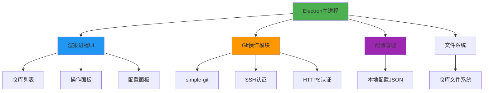
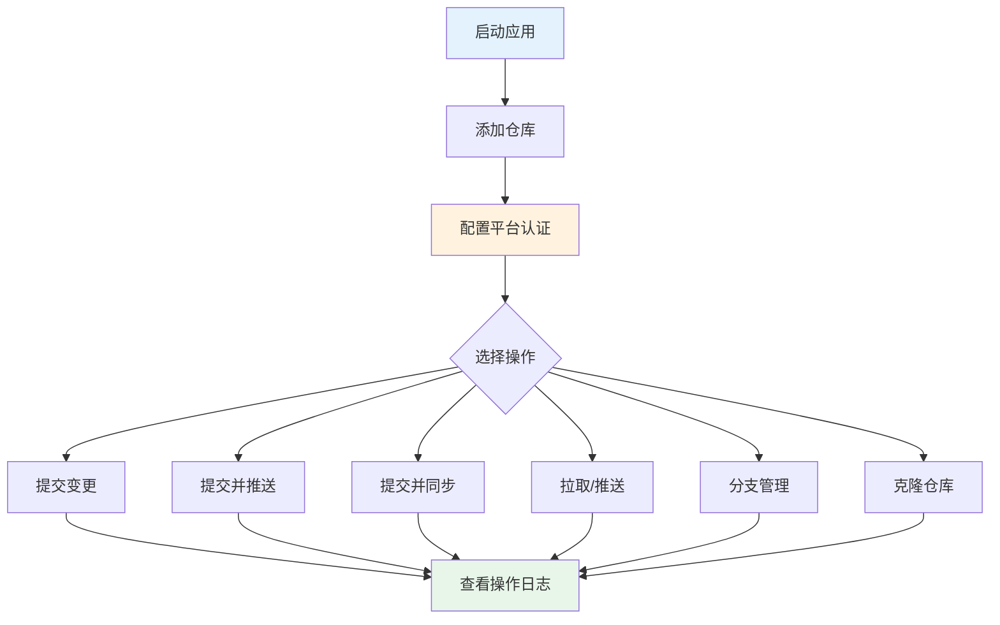
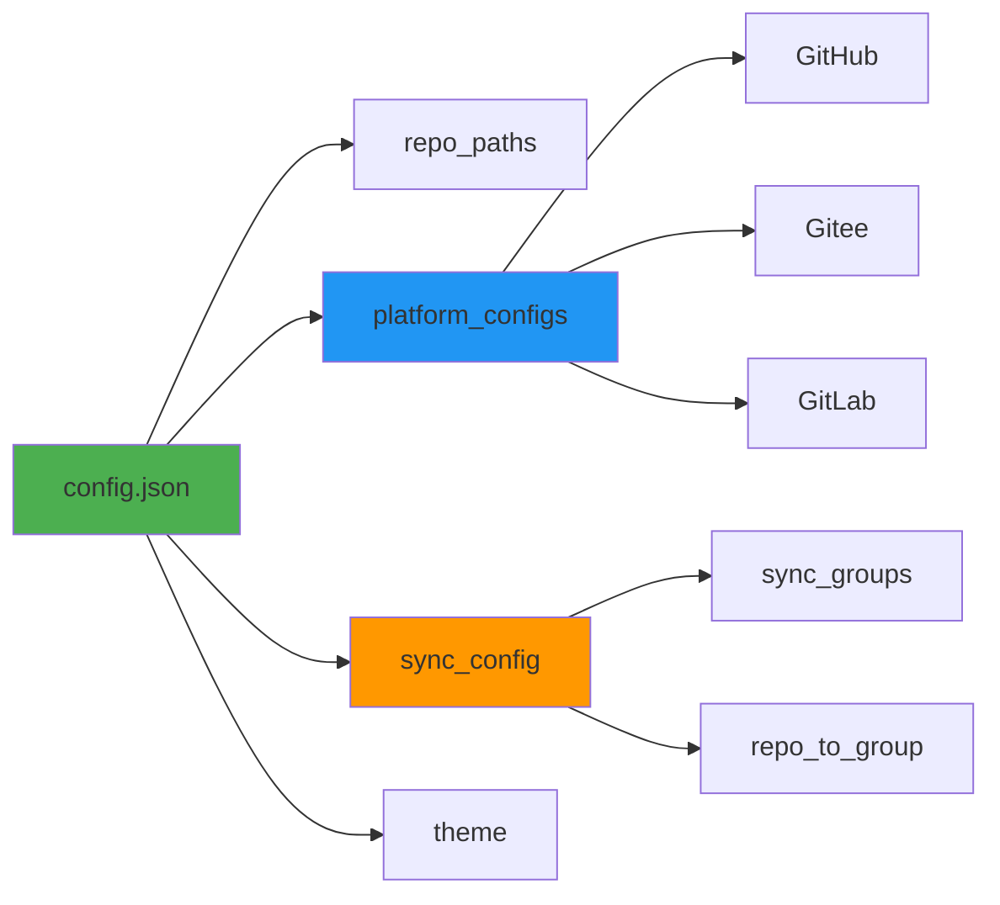

# 🌻 向日葵Git仓库管理 v2.5

基于 Electron 的现代化 Git 仓库管理工具，提供简洁直观的图形界面，支持多平台 Git 仓库的统一管理。

## ✨ 核心功能

- **多平台支持**：GitHub、Gitee、GitCode、GitLab 等
- **多种认证方式**：SSH 密钥、HTTPS Token/密码
- **一键提交推送**：自动添加变更摘要，支持提交并推送到远程
- **主从仓库同步**：配置主从关系，一键同步到多个仓库
- **批量操作**：批量提交、推送、拉取多个仓库
- **分支管理**：创建、切换分支，查看提交日志和文件差异
- **仓库克隆**：支持 HTTPS、SSH 及代理 URL
- **主题切换**：支持浅色/深色主题

## 🏗️ 系统架构



## 🚀 快速开始

### 系统要求

- **操作系统**：Windows 7+ / macOS 10.10+ / Linux
- **Node.js**：v14.0.0+（开发环境）
- **pnpm**：v7.0.0+（必需）
- **Git**：已安装并配置（必需）

### 安装

```bash
# 安装依赖
pnpm install

# 运行开发版本
pnpm dev

# 打包应用
pnpm build:win    # Windows自动检测架构
pnpm build:win64  # Windows 64位
pnpm build        # 所有平台
```

## 📖 使用指南

### 工作流程



### 1. 添加仓库

点击工具栏 **「添加仓库」** → 选择包含 `.git` 目录的文件夹

> 💡 仓库路径会保存到本地配置，下次启动自动加载

### 2. 配置平台认证

点击工具栏 **「平台配置」** → 选择平台标签 → 配置认证方式

**SSH 密钥（推荐）**
- 选择私钥文件（如 `id_ed25519`、`id_rsa`）
- 未选择时自动检测 `~/.ssh` 目录下的默认密钥

**账号密码/Token**
- 填写用户名和 Token（GitHub 使用 Personal Access Token）
- 填写邮箱（用于 Git 提交）

**GitHub 代理（可选）**
- 勾选「使用代理」
- 推荐代理：`https://ghproxy.net/`、`https://gh-proxy.com/`

### 3. 配置同步关系（可选）

点击工具栏 **「同步配置」** → 选择主仓库 → 勾选从仓库 → 保存

**同步机制：**
- 相同远程 URL：自动执行 `git pull`
- 不同远程 URL：复制文件（忽略 `.git`、`node_modules` 等）并推送

### 4. 基本操作

| 操作 | 说明 |
|------|------|
| **一键提交** | 自动追加变更摘要（文件数、变更类型、行数统计） |
| **提交并推送** | 提交并推送到远程仓库 |
| **提交并同步** | 提交主仓库并同步到所有从仓库 |
| **⬇️ 拉取** | 从远程拉取最新变更 |
| **⬆️ 推送** | 推送本地提交到远程 |
| **🌿 创建分支** | 创建新分支 |
| **🔀 切换分支** | 切换分支 |
| **📜 查看日志** | 查看提交历史 |
| **🔍 查看差异** | 查看文件变更差异 |

### 5. 批量操作

点击工具栏 **「批量操作」** → 选择操作类型 → 勾选仓库 → 确定

> 💡 批量提交自动使用时间戳作为提交信息

### 6. 克隆仓库

点击工具栏 **「克隆仓库」** → 选择平台 → 输入 URL → 选择目标目录 → 确定

支持 HTTPS、SSH 及代理 URL，克隆成功后自动添加到列表。

## ⚙️ 配置说明

### 配置文件位置

- **Windows**：`%APPDATA%\git-manager-electron\config.json`
- **macOS**：`~/Library/Application Support/git-manager-electron/config.json`
- **Linux**：`~/.config/git-manager-electron/config.json`

### 配置结构



**配置示例：**

```json
{
  "repo_paths": ["仓库路径1", "仓库路径2"],
  "platform_configs": {
    "GitHub": {
      "auth_type": "ssh",
      "ssh_key_path": "C:\\Users\\username\\.ssh\\id_ed25519",
      "username": "your-username",
      "email": "your@email.com",
      "use_proxy": true,
      "proxy_url": "https://ghproxy.net/"
    }
  },
  "sync_config": {
    "sync_groups": {
      "group_1234567890": {
        "main": "主仓库名",
        "subordinates": ["从仓库1", "从仓库2"]
      }
    }
  },
  "theme": "light"
}
```

## ⚠️ 注意事项

### SSH 密钥配置
- 必须选择**私钥文件**（如 `id_ed25519`、`id_rsa`），不要选择公钥文件（`.pub`）
- 未选择时自动检测 `~/.ssh` 目录下的默认密钥
- Linux/macOS 确保私钥权限：`chmod 600 ~/.ssh/id_ed25519`

### Git 配置
首次使用建议配置全局 Git 用户信息：
```bash
git config --global user.name "Your Name"
git config --global user.email "your@email.com"
```

### 代理配置
- GitHub 代理仅在使用 HTTPS 方式时生效
- 推荐使用 SSH 方式，无需配置代理
- 代理 URL 格式：`https://ghproxy.net/`（注意末尾斜杠）

### 同步功能
- 同步会忽略：`.git`、`node_modules`、`__pycache__`、`.venv`、`dist`、`build` 等
- 同步前建议先提交主仓库的变更
- 相同远程 URL 的同步会直接执行 `git pull`，速度更快

## 🔧 故障排除

### 推送/拉取失败
**检查清单：**
1. ✅ 平台配置中的认证信息是否正确
2. ✅ SSH 密钥是否有效：`ssh -T git@github.com`
3. ✅ Token 是否过期（GitHub Token 需要相应权限）
4. ✅ 代理地址是否正确（如使用代理）

### 克隆失败
**检查清单：**
1. ✅ URL 格式是否正确
2. ✅ 是否已配置对应平台的认证信息
3. ✅ 目标目录是否已存在同名文件夹
4. ✅ 网络连接是否正常

### 应用无法启动
**解决方案：**
1. 检查 Node.js 版本：`node --version`（需要 v14+）
2. 检查 pnpm 版本：`pnpm --version`（需要 v7+）
3. 重新安装依赖：删除 `node_modules` 和 `pnpm-lock.yaml` 后重新 `pnpm install`

## 🔄 自动更新

应用支持自动更新功能，通过 GitHub Releases 自动检查并安装更新。

### 用户更新方式

1. **自动检查**：应用启动 3 秒后自动检查更新
2. **手动检查**：点击工具栏的 **「🔄 检查更新」** 按钮
3. **下载安装**：发现新版本后，点击「确定」下载并安装

> 💡 **提示**：更新完全自动化，用户无需手动下载安装包。

---

---

## 👨‍💻 开发者

### 发布新版本

详细发布流程请查看 [DEVELOPER.md](DEVELOPER.md)

**快速发布步骤：**
1. 更新 `package.json` 中的版本号
2. 确保 `.env` 文件已配置 GitHub Token
3. 运行 `pnpm run publish:win64` 构建并发布

> 📖 **注意**：发布更新是开发者操作，用户无需关心。用户安装的应用会自动从 GitHub Releases 检查更新。

## 📝 更新日志

### v2.5.0
- ✨ 新增通知系统，替换原有的 alert 弹窗
- 🎨 优化 UI 动画效果和响应式设计
- 🔧 优化代码结构，提取重复逻辑
- 🐛 修复多个已知问题
- 📚 完善文档和使用说明
- 🔄 新增自动更新功能

## 🤝 贡献

欢迎提交 Issue 和 Pull Request！

## 📄 许可证

MIT License

---

> 💡 **提示**：首次使用请先配置平台认证信息，推荐使用 SSH 密钥方式，更安全且无需配置代理。
