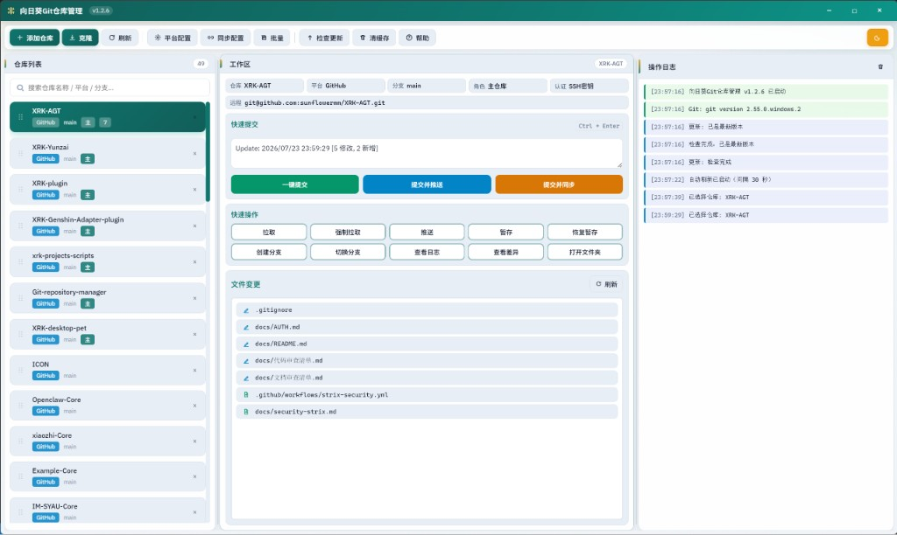
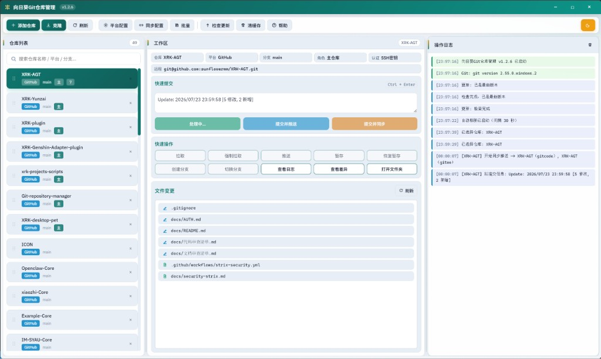
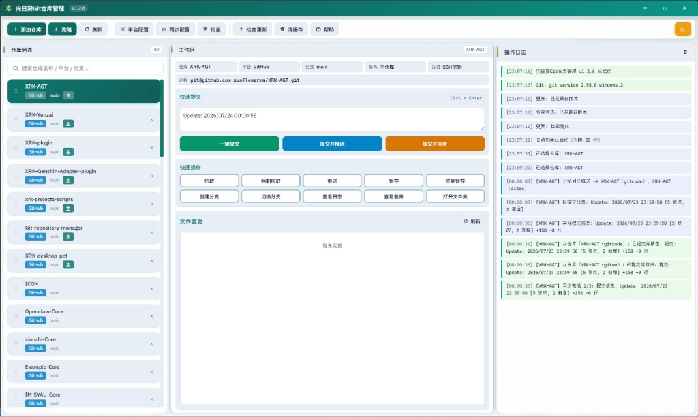
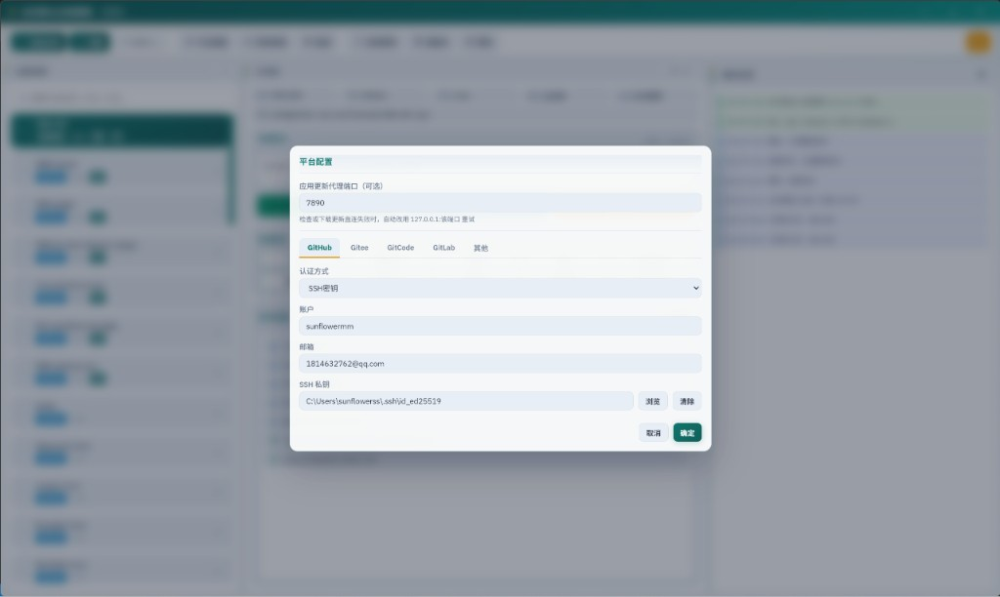
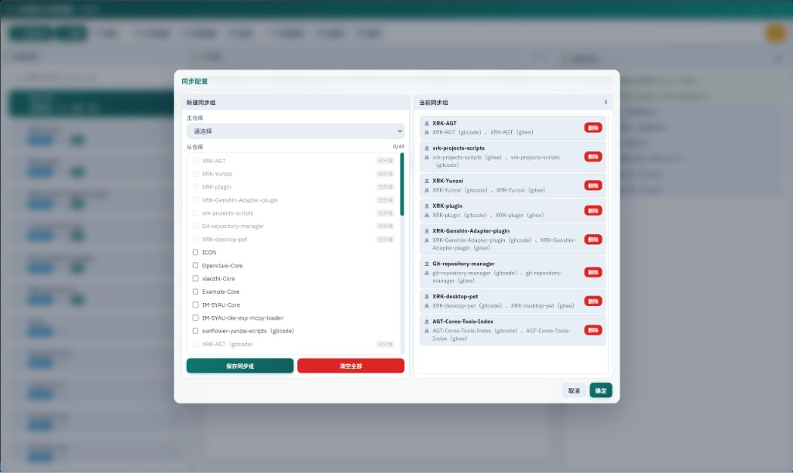
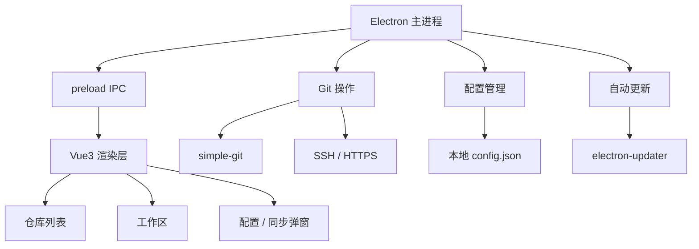

#  向日葵Git仓库管理

基于 **Electron + Vue 3** 的桌面端 Git 仓库管理工具。统一管理 GitHub / Gitee / GitCode / GitLab 等平台上的本地仓库，支持一键提交、推送、主从同步与自动更新。

当前发行版：**v1.2.15**

## 界面预览

### 主界面总览

三栏布局：左侧仓库列表与搜索、中间工作区（仓库信息 / 快速提交 / 快捷操作 / 文件变更）、右侧操作日志。选中仓库后即可查看远程地址、分支、主从角色与认证方式。



### 提交过程

点击「一键提交」等操作后，对应按钮会进入进行中状态；右侧日志实时记录进度。



### 提交结果与行数统计

提交完成后，日志输出真实提交信息，并附带文件类型摘要与行数（如 `[5 修改, 2 新增] +158 -0 行`）。工作区「文件变更」会随状态刷新。



### 平台配置

按平台分别配置 SSH / Token、账户与邮箱；顶部可填写**应用更新代理端口**（检查或下载更新直连失败时，改用 `127.0.0.1:端口` 重试）。



### 同步配置

左侧新建同步组（主仓库 + 从仓库），右侧查看已保存分组。适合同一项目在多个托管平台上的镜像同步。



## 核心功能

| 能力 | 说明 |
|------|------|
| 多平台 | GitHub、Gitee、GitCode、GitLab、其他 |
| 认证 | SSH 私钥（推荐）或 HTTPS Token/密码；可按平台分别配置 |
| 一键提交 | 自动生成带时间戳的提交信息，统计修改/新增/删除/重命名文件数与 +/- 行数 |
| 提交并推送 | 本地提交后推送到 `origin` |
| 提交并同步 | 主仓库提交后，按同步组同步到从仓库并推送 |
| 批量操作 | 对多个仓库批量 push / pull / commit |
| 分支 | 创建、切换分支；查看提交日志 |
| 查看差异 | 执行 `git diff`，以文本弹窗展示**未暂存**的已跟踪文件改动 |
| 克隆 | HTTPS / SSH / 代理 URL，克隆后自动加入列表 |
| 自动更新 | 从哪安装从哪更新；可配置本地代理端口（如 Clash `7890`） |
| 主题 | 浅色 / 深色 |

## 系统架构


```mermaid
graph TB
    A[Electron 主进程] --> P[preload IPC]
    P --> B[Vue3 渲染层]
    A --> C[Git 操作]
    A --> D[配置管理]
    A --> E[自动更新]

    B --> F[仓库列表]
    B --> G[工作区]
    B --> H[配置 / 同步弹窗]

    C --> I[simple-git]
    C --> J[SSH / HTTPS]
    D --> L[本地 config.json]
    E --> U[electron-updater]
```

## 快速开始

### 系统要求

- **操作系统**：Windows 7+（当前发行版以 Windows 安装包为主）
- **Git**：已安装并可用（必需）
- **开发**：Node.js 18+（仅源码开发需要）

### 安装使用

从对应平台的 Releases 下载安装包（**从哪下就从哪更新**）：

- [GitHub Releases](https://github.com/sunflowermm/git-repository-manager/releases)
- [Gitee Releases](https://gitee.com/xrkseek/git-repository-manager/releases)
- [GitCode Releases](https://gitcode.com/Xrkseek/git-repository-manager/-/releases)

### 开发与打包

```bash
npm install
npm run dev          # Vite 热更新 + Electron
npm run build:ui     # 仅构建 Vue 渲染层到 ui-dist/
npm run build        # 构建 UI 并打包安装包
npm run publish      # 构建并发布多平台发行版
```

## 使用指南

### 1. 添加仓库

工具栏 **「添加仓库」** → 选择含 `.git` 的文件夹。路径会写入本地配置，下次启动自动加载。

### 2. 配置平台认证

工具栏 **「平台配置」**：

1. （可选）填写 **应用更新代理端口**，如 `7890`
2. 切换平台标签（GitHub / Gitee / …）
3. 选择认证方式并填写账户、邮箱
4. SSH：选择私钥（勿选 `.pub`）；未填时会尝试检测 `~/.ssh` 默认密钥
5. GitHub + HTTPS 时可勾选镜像代理（如 `https://ghproxy.net/`）

### 3. 配置同步关系（可选）

工具栏 **「同步配置」**：

1. 选择**主仓库**
2. 勾选**从仓库**（已在其他组中的仓库会标记「已分组」）
3. **保存同步组** → 底部 **确定** 写入配置

同步机制：

- 远程 URL 相同：对从仓库执行 `git pull`
- 远程 URL 不同：按主仓 **gitignore 规则**复制应入库文件（`git ls-files`，不含本地忽略的业务 Core 等），并剔除从仓误跟踪项后再推送

### 4. 日常操作

| 操作 | 说明 |
|------|------|
| 一键提交 | `git add -A` 后提交；信息含文件类型摘要与行数 |
| 提交并推送 | 提交后 `git push` |
| 提交并同步 | 有变更则提交；无变更也继续同步到从仓（适合拉取后） |
| 同步从仓 | 不新建提交，推送主仓当前状态并复制到从仓 |
| 拉取 / 强制拉取 | 拉取远程；强制拉取会覆盖本地冲突（慎用） |
| 推送 | 推送已有本地提交 |
| 暂存 / 恢复暂存 | `stash` / `stash pop` |
| 创建 / 切换分支 | 分支管理 |
| 查看日志 | 最近提交历史 |
| 查看差异 | `git diff`：仅未暂存的已跟踪文件，不含暂存区与未跟踪新文件 |
| 打开文件夹 | 在资源管理器中打开仓库目录 |

默认提交信息示例：

```text
Update: 2026/07/23 23:59:29 [5 修改, 2 新增] +158 -0 行
```

输入框内为预览；真正提交时主进程会按暂存结果重新统计并写入最终信息。

### 5. 批量操作

工具栏 **「批量」** → 选择 push / pull / commit → 勾选仓库 → 确定。

### 6. 克隆仓库

工具栏 **「克隆」** → 填写 URL、平台与目标目录 → 确定。成功后自动加入列表。

## 注意事项

### SSH

- 选择**私钥**（`id_ed25519` / `id_rsa`），不要选 `.pub`
- Linux/macOS：`chmod 600 ~/.ssh/id_ed25519`

### Git 用户信息

平台配置中的账户/邮箱会在提交时写入仓库本地 `user.name` / `user.email`。也可预先配置全局：

```bash
git config --global user.name "Your Name"
git config --global user.email "your@email.com"
```

### 代理

- **应用更新代理**：平台配置顶部的端口，用于检查/下载更新（优先代理，失败再直连）
- **GitHub HTTPS 镜像**：仅在该平台使用密码/Token 认证且勾选代理时生效
- 推荐优先使用 SSH，推拉一般无需 HTTP 镜像

### 同步

- 异远程：按主仓 `.gitignore` 复制应入库文件；并剔除从仓「忽略但仍跟踪」的历史项
- 另跳过硬编码目录名：`.git`、`node_modules`、`.venv`、`dist` 等
- 建议先保证主仓库变更可提交再同步

## 故障排除

**推送 / 拉取失败**

1. 平台认证、SSH 密钥或 Token 是否有效（`ssh -T git@github.com`）
2. Token 权限与是否过期
3. 网络 / 代理是否可达

**更新检查失败**

1. 在「平台配置」填写本地代理端口后重试
2. 工具栏「清缓存」后再「检查更新」
3. 确认安装包来源平台的 Release 已上传 `latest.yml` 与安装包

**克隆失败**

1. URL 与认证是否匹配（SSH URL 需 SSH 密钥）
2. 目标目录是否已有同名文件夹

## 自动更新

- GitHub / Gitee / GitCode 发行版各自独立，更新源不串台
- 启动后后台检查；也可手动「检查更新」
- 发现新版本 → 下载（可显示进度）→ 立即重启或稍后安装

## 更新日志

详见 [history/](history/)（如 [v1.2.15](history/v1.2.15.md)）。界面截图见 [docs/screenshots/](docs/screenshots/)。

## 贡献

欢迎提交 Issue 与 Pull Request。

## 许可证

MIT License

---

首次使用请先完成 **平台配置**（推荐 SSH），再添加仓库开始使用。
